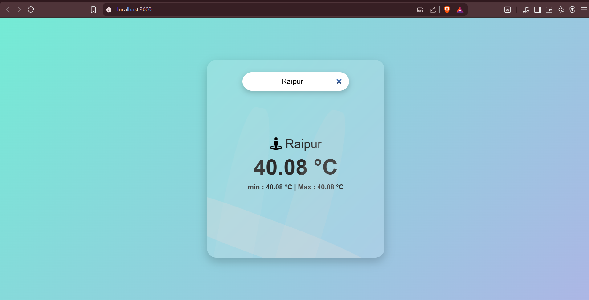

# 🌦️ Weather App

A beautiful and responsive Weather App built using **React.js** with a modern UI inspired by Technical Thapa.

---

## 🚀 Features

- 🔍 Search city weather
- 🌡️ Displays temperature
- 📉 Shows min & max temperature
- 📍 Location with icon
- 🌊 Animated wave background
- 📱 Fully responsive (Mobile, Tablet, Laptop)
- ❌ Shows "Data Not Found" if city is invalid

---

## 🛠️ Tech Stack

- React.js
- HTML5
- CSS3
- Font Awesome

---

## 📸 Screenshot




---

## ⚙️ Installation

1. Clone the repository
```bash
git clone https://github.com/your-username/weather-app.git
